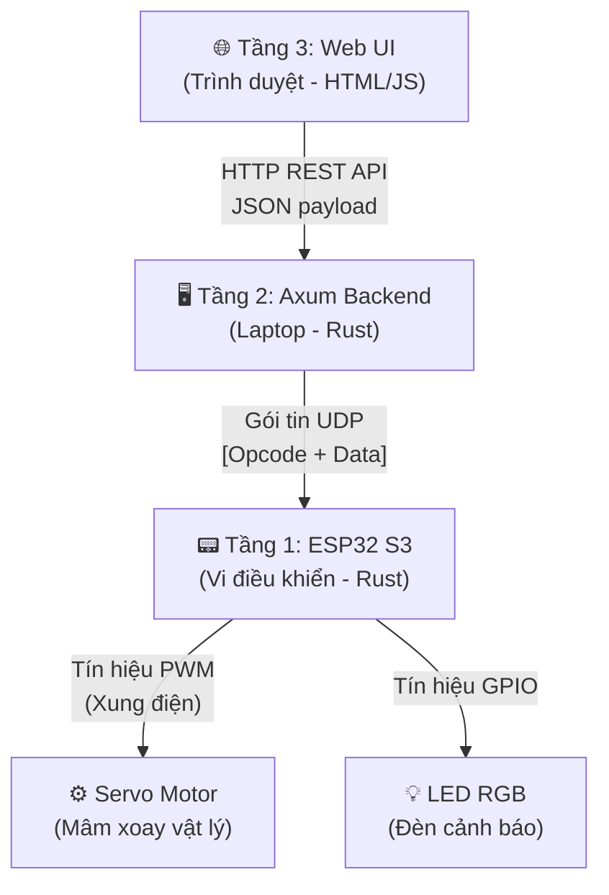

# 📋 Tài liệu Kiến trúc Hệ thống AI Mosquito Sorter
## Mô tả chi tiết luồng hoạt động từng API — Từ Web UI đến Servo vật lý

> **Mục đích**: Tài liệu này giúp các quản lý dự án (Manager) và kỹ sư mới review toàn bộ kiến trúc hệ thống. Mỗi luồng API được trình bày theo thứ tự từ tầng cao nhất (Web UI) xuống tầng thấp nhất (Firmware ESP32 điều khiển Servo) kèm **ví dụ minh họa cụ thể** với dữ liệu thực tế.

---

## Mục lục

1. [Tổng quan Kiến trúc 3 tầng](#tổng-quan-kiến-trúc-3-tầng)
2. [Luồng 1: Reset về vị trí gốc (Home)](#luồng-1-reset-về-vị-trí-gốc-home)
3. [Luồng 2: Xoay mâm sang Trái N độ](#luồng-2-xoay-mâm-sang-trái-n-độ)
4. [Luồng 3: Xoay mâm sang Phải N độ](#luồng-3-xoay-mâm-sang-phải-n-độ)
5. [Luồng 4: Xoay Ô chỉ định đến Góc mong muốn](#luồng-4-xoay-ô-chỉ-định-đến-góc-mong-muốn)
6. [Luồng 5: Hoán đổi vị trí hai Ô trên mâm](#luồng-5-hoán-đổi-vị-trí-hai-ô-trên-mâm)
7. [Luồng 6: Giả lập phát hiện loài muỗi (Simulation)](#luồng-6-giả-lập-phát-hiện-loài-muỗi-simulation)
8. [Luồng 7: AI Camera tự động nhận diện muỗi](#luồng-7-ai-camera-tự-động-nhận-diện-muỗi)
9. [Luồng 8: Chuyển đổi Chế độ vận hành](#luồng-8-chuyển-đổi-chế-độ-vận-hành)
10. [Luồng 9: Truy vấn trạng thái hệ thống](#luồng-9-truy-vấn-trạng-thái-hệ-thống)
11. [Luồng 10: Lấy danh sách 36 loài muỗi](#luồng-10-lấy-danh-sách-36-loài-muỗi)
12. [Luồng 11: Camera Snapshot (Live Video Feed)](#luồng-11-camera-snapshot-live-video-feed)
13. [Luồng 12: Lịch sử nhận diện muỗi](#luồng-12-lịch-sử-nhận-diện-muỗi)
14. [Phụ lục: Bảng tham chiếu Opcode UDP](#phụ-lục-bảng-tham-chiếu-opcode-udp)
15. [Phụ lục: Sơ đồ File & Hàm](#phụ-lục-sơ-đồ-file--hàm)

---

## Tổng quan Kiến trúc 3 tầng



| Tầng | Vai trò | File chính | Ngôn ngữ |
|------|---------|-----------|-----------|
| **Tầng 3** | Giao diện Web & REST Server | `web_ui/src/main.js`, `web_server.rs` | JavaScript, Rust |
| **Tầng 2** | Logic nghiệp vụ & Driver phần cứng | `api_layer3.rs`, `hardware.rs`, `iot.rs` | Rust |
| **Tầng 1** | Firmware nhận lệnh & điều khiển vật lý | `system.rs`, `sorter.rs`, `servo.rs` | Rust (ESP32) |

---

## Luồng 1: Reset về vị trí gốc (Home)

> **Ví dụ minh họa**: Người dùng bấm nút **"🏠 Reset về vị trí gốc (Home 0°)"** trên giao diện Web để đưa toàn bộ mâm xoay về vị trí xuất phát ban đầu.

### Bước 1 — Web UI (Trình duyệt)
**File:** `web_ui/src/main.js`
**Hàm:** Sự kiện click trên nút `btn-reset-home`

```javascript
btnResetHome.addEventListener('click', () => postAPI('/reset_home'));
```

**Hành động:** Gửi yêu cầu HTTP `POST` đến `http://localhost:3000/api/reset_home`.
**Payload:** Không có (body rỗng `{}`).

---

### Bước 2 — Axum REST Server (Laptop Backend)
**File:** `app_cli/src/web_server.rs`
**Hàm:** `post_reset_home(state)`

```rust
async fn post_reset_home(State(state): State<WebState>) -> StatusCode {
    api_layer3::reset_home(&*state.backend);
    StatusCode::OK
}
```

**Hành động:** Nhận yêu cầu HTTP. Truy cập đối tượng phần cứng `state.backend` và chuyển tiếp xuống Tầng 2.
**Trả về:** HTTP Status Code `200 OK`.

---

### Bước 3 — Logic điều khiển (Tầng 2)
**File:** `app_cli/src/api_layer3.rs`
**Hàm:** `reset_home(backend)`

```rust
pub fn reset_home(backend: &dyn HardwareBackend) {
    backend.reset_home();
}
```

**Hành động:** Gọi trực tiếp phương thức `reset_home()` trên giao diện Driver trừu tượng. Không cần tính toán góc.

---

### Bước 4 — Driver phần cứng (Tầng 2)
**File:** `app_cli/src/hardware.rs`

| Driver | Hành động |
|--------|----------|
| **Esp32Backend** | Gọi `self.sender.send_opcode_reset()` → gửi gói tin UDP. Cập nhật `current_angle = 0`. |
| **PlcBackend** | In ra terminal: `[PLC] Reset servo về vị trí ban đầu (0°)`. Cập nhật `current_angle = 0`. |
| **DisconnectedBackend** | Không làm gì (nuốt lệnh để tránh crash). |

---

### Bước 5 — Giao thức mạng UDP (Tầng 1)
**File:** `app_cli/src/iot.rs`
**Hàm:** `send_opcode_reset()`

```rust
pub fn send_opcode_reset(&self) {
    let payload = [0x03];
    let _ = self.socket.send_to(&payload, &self.target_addr);
}
```

**Dữ liệu gửi đi:** Gói tin UDP **1 byte**: `[0x03]`
**Đích đến:** IP của ESP32 S3, cổng `8888`.

---

### Bước 6 — Firmware ESP32 S3 (Tầng 1)
**File:** `esp32_led_receiver/src/system.rs`

**Hành động:**
1. Vòng lặp UDP nhận được gói tin 1 byte, đọc Opcode = `0x03`.
2. Gọi `sorter.reset_to_home()` → Servo xoay mâm vật lý về vị trí `0°`.
3. LED tắt hoàn toàn.

---

## Luồng 2: Xoay mâm sang Trái N độ

> **Ví dụ minh họa**: Mâm đang ở góc **30°**. Người dùng nhập **10** vào ô "Độ xoay trái" và bấm **"⬅ Xoay Trái"**. Kết quả: mâm xoay ngược chiều kim đồng hồ 10° → dừng ở **20°**.

### Bước 1 — Web UI
**File:** `web_ui/src/main.js`

```javascript
btnRotateLeft.addEventListener('click', () => {
    const deg = parseInt(rotateLeftDeg.value) || 0; // deg = 10
    postAPI('/rotate_left', { degrees: deg });
});
```

**HTTP Request:** `POST /api/rotate_left`
**Payload JSON:** `{ "degrees": 10 }`

---

### Bước 2 — Axum REST Server
**File:** `app_cli/src/web_server.rs`
**Hàm:** `post_rotate_left(state, payload)`

```rust
async fn post_rotate_left(
    State(state): State<WebState>,
    Json(payload): Json<RotateRequest>,  // payload.degrees = 10
) -> StatusCode {
    api_layer3::rotate_left(&*state.backend, payload.degrees);
    StatusCode::OK
}
```

---

### Bước 3 — Logic điều khiển
**File:** `app_cli/src/api_layer3.rs`
**Hàm:** `rotate_left(backend, n_degrees)`

```rust
pub fn rotate_left(backend: &dyn HardwareBackend, n_degrees: i32) {
    let current = backend.get_current_angle();  // current = 30
    let new_angle = normalize_angle(current - n_degrees); // normalize_angle(30 - 10) = 20
    backend.rotate_servo(new_angle); // Gửi lệnh xoay đến 20°
}
```

**Tính toán cụ thể:**
- Góc hiện tại: `30°`
- Trừ đi số độ xoay trái: `30 - 10 = 20`
- Chuẩn hóa: `normalize_angle(20) = 20°`
- **Kết quả:** Ra lệnh xoay servo đến góc tuyệt đối `20°`.

---

### Bước 4 — Driver → UDP → ESP32 → Servo
*(Giống Bước 4-6 của Luồng 1, nhưng sử dụng Opcode `0x02` thay vì `0x03`)*

**Dữ liệu UDP gửi đi:** `[0x02, 0x00, 0x14]` (góc 20 = `0x0014`)
**ESP32 nhận:** Giải mã angle = `(0x00 << 8) | 0x14 = 20`. Gọi `sorter.rotate_to(20)`.
**Servo vật lý:** Xoay mâm đến vị trí 20°.

---

## Luồng 3: Xoay mâm sang Phải N độ

> **Ví dụ minh họa**: Mâm đang ở góc **350°**. Người dùng nhập **30** và bấm **"Xoay Phải ➡"**. Kết quả: mâm xoay thuận chiều kim đồng hồ 30° → vượt qua mốc 360° → dừng ở **20°**.

### Bước 1 — Web UI
**Payload JSON:** `{ "degrees": 30 }`
**HTTP Request:** `POST /api/rotate_right`

### Bước 2 — Axum REST Server
**Hàm:** `post_rotate_right(state, payload)` → gọi `api_layer3::rotate_right(&*state.backend, 30)`

### Bước 3 — Logic điều khiển
**File:** `app_cli/src/api_layer3.rs`
**Hàm:** `rotate_right(backend, n_degrees)`

```rust
pub fn rotate_right(backend: &dyn HardwareBackend, n_degrees: i32) {
    let current = backend.get_current_angle();  // current = 350
    let new_angle = normalize_angle(current + n_degrees); // normalize_angle(350 + 30) = normalize_angle(380) = 20
    backend.rotate_servo(new_angle); // Gửi lệnh xoay đến 20°
}
```

**Tính toán cụ thể:**
- Góc hiện tại: `350°`
- Cộng thêm số độ xoay phải: `350 + 30 = 380`
- Chuẩn hóa về [0, 360): `normalize_angle(380) = 380 % 360 = 20°`
- **Kết quả:** Servo xoay qua mốc 0° và dừng ở `20°`.

> [!TIP]
> Hàm `normalize_angle()` đảm bảo góc luôn nằm trong khoảng `[0, 360)`. Công thức: `((angle % 360) + 360) % 360`. Phép `+ 360` xử lý trường hợp góc âm (ví dụ: `normalize_angle(-10) = 350°`).

---

## Luồng 4: Xoay Ô chỉ định đến Góc mong muốn

> **Ví dụ minh họa**: Mâm hiện đang ở góc **50°**. Người dùng chọn **Ô C** (góc mốc mặc định = 20°) và nhập góc đích là **90°**, bấm **"🎯 Thực thi"**. Mục đích: xoay mâm sao cho Ô C hướng đúng về vị trí 90°.

### Bước 1 — Web UI
**File:** `web_ui/src/main.js`

```javascript
btnSlotToAngle.addEventListener('click', () => {
    const slot = slotToAngleSelect.value;      // slot = "C"
    const angle = parseInt(slotTargetAngle.value) || 0;  // angle = 90
    postAPI('/rotate_slot_to_angle', { slot, angle });
});
```

**HTTP Request:** `POST /api/rotate_slot_to_angle`
**Payload JSON:** `{ "slot": "C", "angle": 90 }`

---

### Bước 2 — Axum REST Server
**File:** `app_cli/src/web_server.rs`
**Hàm:** `post_rotate_slot_to_angle(state, payload)`

```rust
async fn post_rotate_slot_to_angle(
    State(state): State<WebState>,
    Json(payload): Json<RotateSlotRequest>,
) -> StatusCode {
    if let Some(slot_idx) = slot_index(&payload.slot) {
        // slot_index("C") → Some(2)
        api_layer3::rotate_slot_to_angle(&*state.backend, slot_idx, payload.angle);
        StatusCode::OK
    } else {
        StatusCode::BAD_REQUEST  // Tên ô không hợp lệ
    }
}
```

**Hành động:**
1. Gọi `slot_index("C")` → trả về `Some(2)` (Ô C có index = 2).
2. Chuyển tiếp xuống hàm nghiệp vụ với tham số `(backend, 2, 90)`.

---

### Bước 3 — Logic điều khiển
**File:** `app_cli/src/api_layer3.rs`
**Hàm:** `rotate_slot_to_angle(backend, slot_idx, target_angle)`

```rust
pub fn rotate_slot_to_angle(backend: &dyn HardwareBackend, slot_idx: usize, target_angle: i32) {
    let current_disk_angle = backend.get_current_angle(); // 50
    let original_slot_angle = slot_angle(slot_idx);        // slot_angle(2) = 2 * 10 = 20

    // Vị trí thực tế hiện tại của Ô C trên mâm
    let actual_slot_pos = normalize_angle(original_slot_angle + current_disk_angle);
    // normalize_angle(20 + 50) = 70

    // Tính khoảng cách ngắn nhất từ vị trí thực 70° đến đích 90°
    let delta = shortest_rotation(actual_slot_pos, target_angle);
    // shortest_rotation(70, 90) = 20

    // Góc mới của đĩa xoay
    let new_disk_angle = normalize_angle(current_disk_angle + delta);
    // normalize_angle(50 + 20) = 70

    backend.rotate_servo(new_disk_angle); // Xoay đĩa đến 70°
}
```

**Tính toán từng bước:**

| Biến | Giá trị | Giải thích |
|------|---------|-----------|
| `current_disk_angle` | `50°` | Góc quay hiện tại của đĩa (lấy từ bộ nhớ Laptop) |
| `original_slot_angle` | `20°` | Góc mốc ban đầu của Ô C (index 2 × 10°/ô) |
| `actual_slot_pos` | `70°` | Vị trí thực tế của Ô C = góc mốc + góc đĩa = 20 + 50 |
| `delta` | `+20°` | Khoảng cách ngắn nhất từ 70° đến 90° = quay phải 20° |
| `new_disk_angle` | `70°` | Góc đĩa mới = 50 + 20 = 70° |

**Kết quả:** Servo xoay đĩa từ `50°` sang `70°` (xoay thêm 20° sang phải), khiến Ô C (vốn ở vị trí thực tế 70°) di chuyển đến đúng mốc `90°`.

---

### Bước 4-6 — Driver → UDP → ESP32 → Servo
**Dữ liệu UDP:** `[0x02, 0x00, 0x46]` (góc 70 = `0x0046`)
**ESP32:** Giải mã angle = 70, gọi `sorter.rotate_to(70)`.
**Servo:** Xoay mâm vật lý đến vị trí 70°.

---

## Luồng 5: Hoán đổi vị trí hai Ô trên mâm

> **Ví dụ minh họa**: Mâm hiện đang ở góc **0°**. Người dùng muốn **di chuyển Ô C đến vị trí của Ô F**. Chọn "Xoay ô: **C**", "Đến vị trí ô: **F**" và bấm **"🔄 Thực thi"**.

### Bước 1 — Web UI
**File:** `web_ui/src/main.js`

```javascript
btnMoveSlot.addEventListener('click', () => {
    const from = slotFromSelect.value;  // from = "C"
    const to = slotToSelect.value;      // to = "F"
    postAPI('/move_slot_to_slot', { from, to });
});
```

**HTTP Request:** `POST /api/move_slot_to_slot`
**Payload JSON:** `{ "from": "C", "to": "F" }`

---

### Bước 2 — Axum REST Server
**File:** `app_cli/src/web_server.rs`
**Hàm:** `post_move_slot_to_slot(state, payload)`

```rust
async fn post_move_slot_to_slot(
    State(state): State<WebState>,
    Json(payload): Json<MoveSlotRequest>,
) -> StatusCode {
    if let (Some(from_idx), Some(to_idx)) = (slot_index(&payload.from), slot_index(&payload.to)) {
        // slot_index("C") → Some(2), slot_index("F") → Some(5)
        api_layer3::move_slot_to_slot(&*state.backend, from_idx, to_idx);
        StatusCode::OK
    } else {
        StatusCode::BAD_REQUEST
    }
}
```

**Hành động:**
1. Ánh xạ `"C"` → index `2`, `"F"` → index `5`.
2. Nếu cả hai hợp lệ, gọi hàm nghiệp vụ `move_slot_to_slot(backend, 2, 5)`.

---

### Bước 3 — Logic điều khiển
**File:** `app_cli/src/api_layer3.rs`
**Hàm:** `move_slot_to_slot(backend, from_idx, to_idx)`

```rust
pub fn move_slot_to_slot(backend: &dyn HardwareBackend, from_idx: usize, to_idx: usize) {
    let from_angle = slot_angle(from_idx);  // slot_angle(2) = 20
    let to_angle = slot_angle(to_idx);      // slot_angle(5) = 50

    // Khoảng cách giữa 2 ô trên đĩa (không phụ thuộc góc hiện tại)
    let delta = shortest_rotation(from_angle, to_angle);
    // shortest_rotation(20, 50) = +30

    let current = backend.get_current_angle(); // current = 0
    let new_angle = normalize_angle(current + delta);
    // normalize_angle(0 + 30) = 30

    backend.rotate_servo(new_angle); // Xoay đĩa đến 30°
}
```

**Tính toán từng bước:**

| Biến | Giá trị | Giải thích |
|------|---------|-----------|
| `from_angle` | `20°` | Góc mốc ban đầu của Ô C (index 2 × 10) |
| `to_angle` | `50°` | Góc mốc ban đầu của Ô F (index 5 × 10) |
| `delta` | `+30°` | Khoảng cách ngắn nhất từ Ô C đến Ô F = quay phải 30° |
| `current` | `0°` | Góc hiện tại của đĩa |
| `new_angle` | `30°` | Góc đĩa mới = 0 + 30 = 30° |

**Kết quả:** Servo xoay mâm từ `0°` sang `30°`, đưa Ô C đến đúng vị trí mà Ô F đang đứng.

> [!IMPORTANT]
> Hàm `shortest_rotation(from, to)` luôn chọn chiều xoay **ngắn nhất** (tối đa 180°). Ví dụ: nếu `from = 10°`, `to = 350°`, kết quả là `-20°` (xoay trái 20°) thay vì `+340°` (xoay phải 340°).

---

### Bước 4 — Driver phần cứng
**File:** `app_cli/src/hardware.rs`

**Với Esp32Backend:**
```rust
fn rotate_servo(&self, angle: i32) {
    self.sender.send_opcode_rotate(angle); // Gửi UDP
    self.current_angle.store(angle, Ordering::SeqCst); // Lưu góc mới
}
```

**Với PlcBackend:**
```rust
fn rotate_servo(&self, angle: i32) {
    println!("  [PLC] Xoay servo đến góc: {}°", angle); // In log
    self.current_angle.store(angle, Ordering::SeqCst);
}
```

---

### Bước 5 — Giao thức mạng UDP
**File:** `app_cli/src/iot.rs`
**Hàm:** `send_opcode_rotate(angle)`

```rust
pub fn send_opcode_rotate(&self, angle: i32) {
    let angle_u16 = (angle as i16) as u16;    // 30 → 0x001E
    let high = (angle_u16 >> 8) as u8;         // 0x00
    let low = (angle_u16 & 0xFF) as u8;        // 0x1E
    let payload = [0x02, high, low];            // [0x02, 0x00, 0x1E]
    let _ = self.socket.send_to(&payload, &self.target_addr);
}
```

**Dữ liệu gói tin UDP:** `[0x02, 0x00, 0x1E]` — tổng cộng **3 byte**
- Byte 0: `0x02` = Opcode xoay tuyệt đối
- Byte 1: `0x00` = Byte cao của góc
- Byte 2: `0x1E` = Byte thấp của góc (= 30)

---

### Bước 6 — Firmware ESP32 S3
**File:** `esp32_led_receiver/src/system.rs`

```
1. Vòng lặp UDP nhận gói tin 3 byte trên cổng 8888.
2. Đọc buf[0] = 0x02 → Dispatch vào nhánh "Xoay tuyệt đối".
3. Giải mã góc: angle = (buf[1] as i16) << 8 | buf[2] as i16 = 30.
4. Gọi sorter.rotate_to(30).
```

**File:** `esp32_led_receiver/src/sorter.rs`
```
1. Tính chiều xoay tối ưu (ngắn nhất).
2. Gọi servo.write_angle(30).
```

**File:** `esp32_led_receiver/src/servo.rs`
```
1. Quy đổi góc 30° thành độ rộng xung PWM tương ứng.
2. Phát xung ra chân GPIO → Động cơ Servo xoay trục vật lý đến 30°.
```

---

## Luồng 6: Giả lập phát hiện loài muỗi (Simulation)

> **Ví dụ minh họa**: Hệ thống đang ở **chế độ Mô phỏng**. Người dùng chọn loài **"Anopheles annulipes" (class_id = 5)** từ dropdown và bấm **"📤 Gửi tín hiệu mô phỏng xuống Phần cứng"**.

### Bước 1 — Web UI
```javascript
btnSimulate.addEventListener('click', () => {
    const classId = speciesSelect.value; // classId = "5"
    postAPI('/simulate_mosquito', { class_id: parseInt(classId) });
});
```

**HTTP Request:** `POST /api/simulate_mosquito`
**Payload JSON:** `{ "class_id": 5 }`

---

### Bước 2 — Axum REST Server
**Hàm:** `post_simulate_mosquito(state, payload)`

**Hành động:**
1. Kiểm tra `state.is_simulation_mode` — nếu `false` → trả về `403 Forbidden` (từ chối).
2. Nếu `true`:
   - Gọi `api_layer3::simulate_mosquito(backend, 5)`.
   - Tính màu LED: `get_species_color(5)` → `RGB(255, 212, 0)` (màu vàng cam).
   - Tra tên loài: `LABELS[5]` → `"Anopheles annulipes"`.
   - Đẩy một bản ghi `DetectionLogEntry` vào danh sách lịch sử nhận diện.
3. Trả về `200 OK`.

---

### Bước 3 — Logic điều khiển
**File:** `app_cli/src/api_layer3.rs`
**Hàm:** `simulate_mosquito(backend, class_id)`

```rust
pub fn simulate_mosquito(backend: &dyn HardwareBackend, class_id: u8) {
    let (r, g, b) = get_species_color(class_id); // (255, 212, 0)
    backend.send_mosquito_command(r, g, b, class_id);
}
```

---

### Bước 4 — Driver phần cứng
**Hàm:** `send_mosquito_command(r, g, b, class_id)` trên Esp32Backend:

```rust
fn send_mosquito_command(&self, r: u8, g: u8, b: u8, class_id: u8) {
    self.sender.send_opcode_mosquito(r, g, b, class_id);
    if class_id != 0xFF && (class_id as u32) < 36 {
        let angle = (class_id as i32) * 10;  // 5 * 10 = 50
        self.current_angle.store(angle, Ordering::SeqCst);
    }
}
```

---

### Bước 5 — Giao thức mạng UDP
**Hàm:** `send_opcode_mosquito(255, 212, 0, 5)`

**Dữ liệu gói tin UDP:** `[0x01, 0xFF, 0xD4, 0x00, 0x05]` — tổng cộng **5 byte**
- Byte 0: `0x01` = Opcode phân loại muỗi
- Byte 1-3: `0xFF, 0xD4, 0x00` = RGB(255, 212, 0)
- Byte 4: `0x05` = class_id = 5

---

### Bước 6 — Firmware ESP32 S3
```
1. Nhận gói tin 5 byte, Opcode = 0x01.
2. Đặt LED RGB = (255, 212, 0) → Đèn sáng vàng cam.
3. class_id = 5 < 36 → Tính góc servo = 5 * 10 = 50°.
4. Gọi sorter.rotate_to(50) → Servo xoay mâm đến ô thứ 5 (Ô F).
```

---

## Luồng 7: AI Camera tự động nhận diện muỗi

> **Ví dụ minh họa**: Camera quay kính hiển vi đang chạy. AI phát hiện muỗi loài **"Culex annulirostris" (class_id = 7, confidence = 92%)** trong khung hình. Hệ thống tự động xoay mâm đến ô loài đó.

### Bước 1 — Thread Camera (Luồng 1)
**File:** `app_cli/src/main.rs`

```
1. Thread 1 liên tục lấy khung hình từ Camera (DroidCam/USB).
2. Ghi đè khung hình mới nhất vào biến chia sẻ `shared_frame`.
```

### Bước 2 — Thread AI Inference (Luồng 2)
**File:** `app_cli/src/main.rs`

```
1. Thread 2 đọc `shared_frame` mỗi 200ms (5 FPS).
2. Gọi detector.detect_image(&frame) → Trả về Vec<Detection>.
3. Kết quả: Detection { class_id: 7, class_name: "Culex annulirostris", confidence: 0.92, ... }
4. In log: "🦟 Da phat hien: Culex annulirostris (92%)"
```

### Bước 3 — Gửi lệnh tự động (vẫn trong Thread 2)
```
1. Kiểm tra: is_simulation_mode == false (chế độ tự động) → cho phép gửi lệnh.
2. Kiểm tra: cooldown 5 giây đã qua → cho phép gửi.
3. Lấy best_match = detections[0] (loài có confidence cao nhất).
4. Tính RGB: get_species_color(7) → RGB(0, 255, 170) (màu xanh lá nhạt).
5. Gọi backend.send_mosquito_command(0, 255, 170, 7).
6. Đẩy bản ghi DetectionLogEntry vào detection_log.
```

### Bước 4-6 — Driver → UDP → ESP32 → Servo
**Gói tin UDP:** `[0x01, 0x00, 0xFF, 0xAA, 0x07]`
**ESP32:** LED = RGB(0, 255, 170). Servo xoay mâm đến góc `7 * 10 = 70°` (Ô H).

> [!NOTE]
> Luồng AI tự động có cơ chế **cooldown 5 giây** giữa các lần gửi lệnh phần cứng liên tiếp, tránh tình trạng servo giật liên tục khi phát hiện nhiều muỗi trong thời gian ngắn.

---

## Luồng 8: Chuyển đổi Chế độ vận hành

> **Ví dụ minh họa**: Người dùng gạt công tắc **"Kích hoạt Chế độ Mô phỏng"** trên giao diện Web.

### Luồng đi
```
Web UI: modeToggle.checked = true → POST /api/mode/simulation
Axum:   set_simulation_mode() → state.is_simulation_mode.store(true)
        In log: "[Web API] Đã chuyển sang chế độ: MÔ PHỎNG"
```

### Luồng ngược (tắt mô phỏng)
```
Web UI: modeToggle.checked = false → POST /api/mode/auto
Axum:   set_auto_mode() → state.is_simulation_mode.store(false)
        In log: "[Web API] Đã chuyển sang chế độ: TỰ ĐỘNG"
```

> [!IMPORTANT]
> Khi ở chế độ **Mô phỏng**, luồng AI Camera (Luồng 7) vẫn chạy nhận diện nhưng **không gửi lệnh phần cứng**. Chỉ lệnh từ nút "Gửi tín hiệu mô phỏng" (Luồng 6) mới được phép đi xuống phần cứng.

---

## Luồng 9: Truy vấn trạng thái hệ thống

> **Ví dụ minh họa**: Web UI gọi API mỗi **1 giây** để cập nhật thanh trạng thái ở đầu trang.

### Luồng đi
```
Web UI: setInterval(updateStatus, 1000) → GET /api/status
Axum:   get_status(state) → đọc backend.get_current_angle(), is_simulation_mode, backend.name()
```

### Dữ liệu JSON trả về
```json
{
  "mode": "auto",
  "current_angle": 70,
  "backend": "ESP32 S3"
}
```

### Web UI xử lý
```
1. Hiển thị badge "🟢 TỰ ĐỘNG" hoặc "🟡 MÔ PHỎNG".
2. Cập nhật label "Góc mâm: 70°".
3. Cập nhật label "Bộ điều khiển: ESP32 S3".
```

---

## Luồng 10: Lấy danh sách 36 loài muỗi

> **Ví dụ minh họa**: Khi trang Web tải lần đầu, hệ thống cần nạp danh sách 36 loài muỗi vào dropdown chọn loài giả lập.

### Luồng đi
```
Web UI: fetchSpeciesList() → GET /api/species_list
Axum:   get_species_list() → Duyệt mảng LABELS[0..35], tính RGB và slot cho mỗi loài.
```

### Dữ liệu JSON trả về (trích)
```json
[
  { "class_id": 0, "name": "Aedes camptorhynchus", "slot": "A", "angle": 0, "rgb": [255, 0, 0] },
  { "class_id": 1, "name": "Aedes hesperonotius", "slot": "B", "angle": 10, "rgb": [255, 42, 0] },
  { "class_id": 5, "name": "Anopheles annulipes", "slot": "F", "angle": 50, "rgb": [255, 212, 0] },
  ...
]
```

### Web UI xử lý
```
1. Nạp vào <select id="species-select"> với format: "[ID 5] Anopheles annulipes".
2. Khi người dùng chọn loài, hiển thị Preview: tên, ID, màu LED, ô mâm, góc xoay.
```

---

## Luồng 11: Camera Snapshot (Live Video Feed)

> **Ví dụ minh họa**: Web UI hiển thị luồng camera trực tiếp với bounding box AI được vẽ đè lên ảnh.

### Luồng đi
```
Web UI: refreshCamera() → Tạo new Image() → src = GET /api/snapshot?t=1721134567
Axum:   get_snapshot(state):
        1. Đọc shared_frame (ảnh thô từ Camera).
        2. Đọc shared_detections (kết quả AI).
        3. Gọi draw_detections() → Vẽ bounding box + nhãn loài lên ảnh.
        4. Nén thành JPEG → Trả về dạng binary với header Content-Type: image/jpeg.
Web UI: newImg.onload → Gán src cho .
        Hiển thị badge "🟢 Trực tiếp".
        Gọi lại refreshCamera() sau 100ms (~10 FPS).
```

### Xử lý lỗi
```
newImg.onerror → Hiển thị overlay "📷 Đang chờ luồng hình ảnh từ Camera..."
                 Badge đổi sang "🔴 Mất kết nối".
                 Retry sau 1 giây.
```

---

## Luồng 12: Lịch sử nhận diện muỗi

> **Ví dụ minh họa**: Bảng lịch sử ở cuối trang Web tự động cập nhật mỗi giây, hiển thị các lần phát hiện muỗi gần nhất.

### Luồng đi
```
Web UI: setInterval(updateDetectionLog, 1000) → GET /api/detection_log
Axum:   get_detection_log(state) → Đọc detection_log từ bộ nhớ chia sẻ → Trả về JSON.
```

### Dữ liệu JSON trả về (trích)
```json
[
  {
    "timestamp_ms": 1784188322396,
    "class_id": 5,
    "species_name": "Anopheles annulipes",
    "confidence": 0.92,
    "rgb": [255, 212, 0],
    "slot": "F",
    "angle": 50
  }
]
```

### Web UI xử lý
```
1. So sánh entries.length với lần trước → Nếu không đổi, bỏ qua (tiết kiệm CPU).
2. Nếu có dữ liệu mới, render lại bảng HTML: Thời gian | Tên loài | ID | Độ tin cậy | Màu LED | Ô mâm | Góc.
3. Dòng mới nhất có hiệu ứng nháy sáng (animation flash-new).
4. Cập nhật badge "N bản ghi".
```

### Nguồn dữ liệu được đẩy vào detection_log từ 2 nơi:
| Nguồn | Khi nào | Confidence |
|-------|---------|-----------|
| **Thread AI tự động** (Luồng 7) | Khi AI phát hiện muỗi thật từ Camera và gửi lệnh phần cứng | Giá trị thật từ model (ví dụ: 0.92) |
| **API mô phỏng** (Luồng 6) | Khi người dùng bấm nút giả lập trên Web | Luôn là 1.0 (100%) |

---

## Phụ lục: Bảng tham chiếu Opcode UDP

| Opcode | Tên lệnh | Kích thước | Cấu trúc gói tin | Mô tả |
|--------|----------|-----------|-------------------|-------|
| `0x01` | Phân loại muỗi | 5 byte | `[0x01, R, G, B, class_id]` | Bật LED theo màu RGB, xoay servo đến ô loài muỗi (góc = class_id × 10°) |
| `0x02` | Xoay tuyệt đối | 3 byte | `[0x02, angle_high, angle_low]` | Xoay servo đến góc tuyệt đối chỉ định (giải mã: `(high << 8) \| low`) |
| `0x03` | Reset Home | 1 byte | `[0x03]` | Đưa servo về vị trí gốc 0°, tắt LED |

> [!NOTE]
> Giao thức UDP được thiết kế **không chờ phản hồi (fire-and-forget)** và **không chặn (non-blocking)**. Điều này đảm bảo luồng AI không bao giờ bị đơ do chờ đợi mạng WiFi.

---

## Phụ lục: Sơ đồ File & Hàm

```mermaid
graph LR
    subgraph "Tầng 3: Web UI"
        JS["main.js"]
    end
    
    subgraph "Tầng 3: REST Server"
        WS["web_server.rs"]
    end
    
    subgraph "Tầng 2: Logic"
        API["api_layer3.rs"]
    end
    
    subgraph "Tầng 2: Driver"
        HW["hardware.rs"]
        IOT["iot.rs"]
    end
    
    subgraph "Tầng 1: ESP32"
        SYS["system.rs"]
        SRT["sorter.rs"]
        SRV["servo.rs"]
    end
    
    JS -->|"HTTP POST/GET"| WS
    WS -->|"Gọi hàm Rust"| API
    API -->|"Gọi Trait method"| HW
    HW -->|"Gọi UDP sender"| IOT
    IOT -->|"Gói tin UDP qua WiFi"| SYS
    SYS -->|"Dispatch Opcode"| SRT
    SRT -->|"Điều khiển PWM"| SRV
```



### Bảng tổng hợp tất cả hàm theo file

#### `web_ui/src/main.js`
| Hàm | Vai trò |
|-----|---------|
| `init()` | Khởi tạo ứng dụng, đăng ký sự kiện, bắt đầu các vòng lặp |
| `postAPI(endpoint, body)` | Gửi HTTP POST dạng JSON đến Backend |
| `fetchSpeciesList()` | Tải danh sách 36 loài muỗi |
| `updateStatus()` | Polling trạng thái hệ thống mỗi 1 giây |
| `refreshCamera()` | Polling ảnh Camera ~10 FPS |
| `updateDetectionLog()` | Polling lịch sử nhận diện mỗi 1 giây |
| `handleModeChange()` | Xử lý gạt công tắc chế độ |
| `handleSpeciesSelectChange()` | Hiển thị Preview khi chọn loài muỗi |
| `handleSimulateClick()` | Gửi lệnh giả lập nhận diện muỗi |
| `populateSlotDropdowns()` | Nạp danh sách 36 ô vào các dropdown điều khiển |

#### `app_cli/src/web_server.rs`
| Hàm | Route | Vai trò |
|-----|-------|---------|
| `start_server()` | — | Khởi động Axum HTTP Server trên cổng 3000 |
| `get_status()` | `GET /api/status` | Trả về trạng thái hiện tại |
| `set_simulation_mode()` | `POST /api/mode/simulation` | Bật chế độ mô phỏng |
| `set_auto_mode()` | `POST /api/mode/auto` | Bật chế độ tự động |
| `post_reset_home()` | `POST /api/reset_home` | Reset mâm về 0° |
| `post_rotate_left()` | `POST /api/rotate_left` | Xoay trái N° |
| `post_rotate_right()` | `POST /api/rotate_right` | Xoay phải N° |
| `post_rotate_slot_to_angle()` | `POST /api/rotate_slot_to_angle` | Xoay ô đến góc |
| `post_move_slot_to_slot()` | `POST /api/move_slot_to_slot` | Di chuyển ô đến vị trí ô khác |
| `post_simulate_mosquito()` | `POST /api/simulate_mosquito` | Giả lập nhận diện muỗi |
| `get_species_list()` | `GET /api/species_list` | Lấy danh sách 36 loài |
| `get_snapshot()` | `GET /api/snapshot` | Lấy ảnh Camera có bounding box |
| `get_detection_log()` | `GET /api/detection_log` | Lấy lịch sử nhận diện |

#### `app_cli/src/api_layer3.rs`
| Hàm | Vai trò |
|-----|---------|
| `slot_name(index)` | Chuyển index → tên ô (0 → "A", 26 → "A0") |
| `slot_index(name)` | Chuyển tên ô → index ("C" → 2) |
| `slot_angle(index)` | Tính góc mốc của ô (index × 10°) |
| `reset_home(backend)` | Đưa mâm về 0° |
| `rotate_left(backend, deg)` | Xoay trái (trừ góc) |
| `rotate_right(backend, deg)` | Xoay phải (cộng góc) |
| `rotate_slot_to_angle(backend, slot, angle)` | Xoay ô chỉ định đến góc đích |
| `move_slot_to_slot(backend, from, to)` | Di chuyển ô đến vị trí ô khác |
| `simulate_mosquito(backend, class_id)` | Gửi lệnh giả lập muỗi |
| `normalize_angle(angle)` | Chuẩn hóa góc về [0, 360) |
| `shortest_rotation(from, to)` | Tính chiều xoay ngắn nhất [-180, +180] |

#### `app_cli/src/hardware.rs`
| Hàm (Trait) | Esp32Backend | PlcBackend | DisconnectedBackend |
|-------------|-------------|-----------|-------------------|
| `name()` | `"ESP32 S3"` | `"PLC công nghiệp"` | `"ESP32 S3 (Mất kết nối)"` |
| `send_mosquito_command()` | Gửi UDP Opcode 0x01 | In log `[PLC]` | Không làm gì |
| `rotate_servo()` | Gửi UDP Opcode 0x02 | In log `[PLC]` | Không làm gì |
| `reset_home()` | Gửi UDP Opcode 0x03 | In log `[PLC]` | Không làm gì |
| `get_current_angle()` | Đọc AtomicI32 | Đọc AtomicI32 | Đọc AtomicI32 |

#### `app_cli/src/iot.rs`
| Hàm | Vai trò |
|-----|---------|
| `UdpSender::new(ip, port)` | Tạo socket UDP non-blocking, phân giải địa chỉ IP |
| `send_opcode_mosquito(r, g, b, class_id)` | Đóng gói & gửi Opcode 0x01 (5 byte) |
| `send_opcode_rotate(angle)` | Đóng gói & gửi Opcode 0x02 (3 byte) |
| `send_opcode_reset()` | Đóng gói & gửi Opcode 0x03 (1 byte) |
| `get_species_color(class_id)` | Tính màu RGB từ vòng tròn HSV cho mỗi loài |
