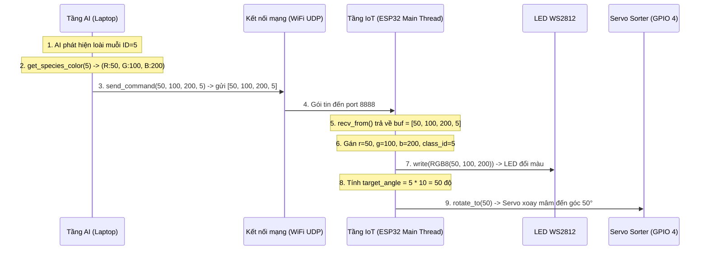

# TÀI LIỆU KHẢO SÁT & THIẾT KẾ CHI TIẾT KIẾN TRÚC HỆ THỐNG PHÂN LOẠI MUỖI

Tài liệu này trình bày chi tiết về kiến trúc phần mềm, triết lý thiết kế, giao thức truyền thông, cơ chế đa luồng và đặc tả chi tiết từng hàm trong hệ thống phân loại muỗi tự động sử dụng AI và IoT.

---

## 1. Tổng quan Kiến trúc Hệ thống 2 Tầng (AI & IoT)

Hệ thống được chia thành 2 tầng vật lý riêng biệt với nhiệm vụ rõ ràng:

1.  **Tầng AI Processing (Laptop):** Đóng vai trò là "Bộ não" (Brain). Tầng này chịu trách nhiệm thu nhận luồng video chất lượng cao từ camera, chạy mô hình học sâu YOLOv9e để nhận diện loài muỗi, ánh xạ kết quả sang mã màu RGB tương ứng và phát tín hiệu điều khiển qua mạng.
2.  **Tầng IoT Control (ESP32 S3):** Đóng vai trò là "Cơ bắp" (Actuator). Tầng này chịu trách nhiệm nhận gói tin điều khiển từ mạng WiFi, trực tiếp điều khiển dải đèn LED WS2812 hiển thị trạng thái và xuất xung PWM điều khiển các động cơ Servo xoay mâm phân loại hoặc kéo băng chuyền. Đồng thời, nó tự giám sát hệ thống nút bấm khẩn cấp thông qua đầu đọc thẻ RFID RC522.

```text
+------------------------------------------+
|            TẦNG 1: LAPTOP (AI)           |
|  [DroidCam] -> [ONNX] -> [UDP Sender]    |
+------------------------------------------+
                     |
            Sóng WiFi (UDP Port 8888)
                     v
+------------------------------------------+
|            TẦNG 2: ESP32 (IoT)           |
|  [UDP Recv] -> [LED & Servos & RFID]     |
+------------------------------------------+
```

---

## 2. Triết lý thiết kế & Phân tích lựa chọn kiến trúc

### 2.1. Tại sao lựa chọn kiến trúc Hiện tại (Decoupled Architecture)?
Kiến trúc hiện tại được xây dựng dựa trên nguyên lý **Phân tách mối quan tâm (Separation of Concerns - SoC)**. Tầng AI chỉ quan tâm đến dữ liệu logic (Loài muỗi nào? Màu gì?), còn Tầng IoT chỉ quan tâm đến việc thực thi vật lý (Xoay bao nhiêu độ? Bật hay tắt động cơ?).

**Các ưu điểm vượt trội:**
*   **Độc lập bảo trì và phát triển (Decoupled Development):** Nếu bạn thay đổi kết cấu cơ khí của đĩa xoay (ví dụ: chuyển từ 36 hộc sang 18 hộc, đổi góc xoay mỗi hộc từ 10° sang 20°), bạn **chỉ cần sửa mã nguồn trên ESP32**. Tầng AI trên Laptop hoàn toàn giữ nguyên vì nó chỉ gửi ID loài muỗi chứ không quan tâm đến góc xoay cơ khí thực tế.
*   **Tách biệt tài nguyên xử lý:** Xử lý mô hình AI nặng (onnxruntime) chạy trên GPU/CPU của Laptop. Các tác vụ điều khiển thời gian thực (Real-time PWM, quét SPI thẻ RFID) chạy trên chip vi điều khiển ESP32 sử dụng nhân FreeRTOS gọn nhẹ, tránh tối đa tình trạng trễ lệnh cơ học.
*   **Khả năng chịu lỗi (Fault Tolerance):** Nếu Laptop bị treo hoặc mất kết nối mạng, băng chuyền và hệ thống dừng khẩn cấp bằng RFID trên ESP32 vẫn tự hoạt động độc lập nhờ luồng RFID chạy ngầm trực tiếp trên chip.

### 2.2. Tại sao KHÔNG chọn kiến trúc Laptop-driven API (Tightly-coupled)?
Trong kiến trúc Laptop-driven API mà bạn đề cập, Laptop sẽ định nghĩa các hàm API cụ thể như `rotate_to_slot_1()`, tự đóng gói cấu trúc cơ khí rồi bắn gói tin xuống yêu cầu ESP32 thực thi. 

Ý tưởng này tuy ban đầu mang lại cảm giác dễ phát triển (vì lập trình viên chỉ cần đứng ở tầng Laptop là điều khiển được toàn bộ hệ thống), nhưng lại mang tới nhiều nhược điểm nghiêm trọng:

1.  **Trở ngại lớn khi bảo trì (Maintenance Nightmare):** Khi có bất kỳ thay đổi nào về phần cơ khí (ví dụ: đổi chân GPIO của servo, đổi loại servo từ 360° sang 180°, hay đổi số lượng hộc chứa trên đĩa xoay), bạn bắt buộc phải **sửa đổi và biên dịch lại mã nguồn của cả Laptop lẫn ESP32**. Việc này vi phạm nghiêm trọng nguyên lý đóng gói trong lập trình hướng đối tượng và kiến trúc hệ thống.
2.  **Làm phức tạp hóa gói tin truyền thông (Bandwidth & Packet Complexity):** Thay vì chỉ gửi 4 byte tinh gọn (`[R, G, B, class_id]`), Laptop sẽ phải gửi các gói tin phức tạp chứa các thông số vật lý (như tốc độ quay, số xung, góc quay tuyệt đối). Việc giải mã các gói tin phức tạp này trên vi điều khiển ESP32 sẽ tốn nhiều tài nguyên xử lý hơn và dễ phát sinh lỗi truyền nhận dữ liệu.
3.  **Hệ thống IoT mất tính độc lập (Dumb Client):** ESP32 lúc này chỉ là một "thiết bị đầu cuối thụ động" không có tư duy độc lập. Nếu luồng RFID quét thẻ phát hiện sự cố, ESP32 không thể tự đưa ra quyết định thông minh mà lại phải gửi ngược tín hiệu lên Laptop hỏi xem có được dừng hay không, hoặc tự dừng nhưng làm lệch pha đồng bộ với luồng xử lý chính của Laptop.
4.  **Tốc độ hệ thống không hề tăng lên:** Như đã phân tích, dù gọi hàm ở đâu thì gói tin vẫn phải đi qua WiFi LAN và động cơ vẫn phải quay bằng đó mili-giây. Tốc độ thô của hệ thống phụ thuộc hoàn toàn vào **tần số quét của Camera, thời gian chạy Inference của mô hình AI, tốc độ mạng LAN và giới hạn vật lý của Servo**, chứ không phụ thuộc vào việc hàm điều khiển nằm ở file nguồn của Laptop hay ESP32.

---

## 3. Kiến trúc Chi tiết Tầng 1 (Laptop - AI Processing)

Tầng Laptop gồm hai thành phần chính: Thư viện xử lý ảnh `ai_vision` và ứng dụng điều phối dòng lệnh `app_cli`.

### Bảng đặc tả chi tiết các hàm cốt lõi ở Tầng Laptop:

| Tên Hàm | Thuộc Module/File | Tham số đầu vào | Giá trị trả về | Nhiệm vụ cụ thể | Nơi gọi hàm (Caller) |
| :--- | :--- | :--- | :--- | :--- | :--- |
| `YoloDetector::new` | `ai_vision/src/core.rs` | `model_path`, `device`, `conf`, `iou` | `Result<Self, DetectorError>` | Khởi tạo phiên ONNX Runtime, nạp mô hình, thiết lập độ tin cậy và ngưỡng IoU. | `run` trong `app_cli/src/main.rs` |
| `YoloDetector::detect_image` | `ai_vision/src/core.rs` | `img` | `Result<Vec<Detection>, DetectorError>` | Tiền xử lý ảnh (co dãn, chuẩn hóa), chạy mô hình và lọc trùng lặp NMS. | Luồng AI (`Inference Thread`) trong `app_cli/src/main.rs` |
| `MjpegStream::new` | `ai_vision/src/stream.rs` | `url` | `Result<Self, DetectorError>` | Mở kết nối HTTP đến luồng phát video MJPEG của DroidCam. | `run_realtime` trong `app_cli/src/main.rs` |
| `MjpegStream::next_frame` | `ai_vision/src/stream.rs` | (Không) | `Result<DynamicImage, DetectorError>` | Quét buffer nhị phân tìm SOI và EOI để bóc tách, giải mã khung hình JPEG. | Luồng Camera (`Network Thread`) trong `app_cli/src/main.rs` |
| `draw_detections` | `ai_vision/src/draw.rs` | `img`, `detections` | (Không) | Vẽ khung chữ nhật và nhãn tên kèm tỷ lệ nhận diện đè lên ảnh. | Luồng giao diện (`UI Thread`) trong `app_cli/src/main.rs` |
| `UdpSender::new` | `app_cli/src/iot.rs` | `ip`, `port` | `Result<Self, Error>` | Tạo socket gửi gói tin UDP không phong tỏa (Non-blocking) để tránh trễ hệ thống. | `run_realtime` trong `app_cli/src/main.rs` |
| `UdpSender::send_command` | `app_cli/src/iot.rs` | `r`, `g`, `b`, `class_id` | (Không) | Đóng gói dữ liệu thành mảng byte và truyền đi qua giao thức UDP. | Luồng AI (`Inference Thread`) trong `app_cli/src/main.rs` |
| `get_species_color` | `app_cli/src/iot.rs` | `class_id` | `(u8, u8, u8)` (RGB) | Ánh xạ ID loài muỗi sang dải màu sắc RGB đặc trưng bằng vòng tròn HSV. | Luồng AI (`Inference Thread`) trong `app_cli/src/main.rs` |

---

## 4. Kiến trúc Chi tiết Tầng 2 (ESP32 - IoT Control & Thực thi)

Mã nguồn trên ESP32 được tổ chức theo cấu trúc phân tầng 3 lớp hoàn chỉnh:

```text
[Lớp 3: Orchestrator]  system::run() (Quản lý WiFi, RFID Thread, nhận UDP)
         |
         v
[Lớp 2: Controller]    sorter::Sorter (Góc quay), conveyor::Conveyor (E-Stop)
         |
         v
[Lớp 1: Abstraction]   servo::ContinuousServo (PWM set_duty cấp thấp)
```

### Bảng đặc tả chi tiết các hàm ở Tầng nhúng ESP32:

| Tên Hàm | Thuộc Module/File | Tham số đầu vào | Giá trị trả về | Nhiệm vụ cụ thể | Nơi gọi hàm (Caller) |
| :--- | :--- | :--- | :--- | :--- | :--- |
| `ContinuousServo::new` | `src/servo.rs` | `driver` | `Self` | Đóng gói driver `LedcDriver` cấp thấp để kiểm soát động cơ servo 360 độ. | `system::run` trong `src/system.rs` |
| `ContinuousServo::set_duty` | `src/servo.rs` | `duty` | `Result<(), Error>` | Thay đổi xung PWM điều khiển tốc độ/hướng quay của Servo. | Các phương thức của Sorter và Conveyor |
| `Sorter::new` | `src/sorter.rs` | `servo` | `Self` | Khởi tạo bộ điều khiển đĩa xoay phân loại muỗi. | `system::run` trong `src/system.rs` |
| `Sorter::reset_to_home` | `src/sorter.rs` | (Không) | `Result<(), Error>` | Xoay mâm phân loại trở lại điểm mốc ban đầu (0 độ). | `system::run` trong `src/system.rs` |
| `Sorter::rotate_to` | `src/sorter.rs` | `target_angle` | `Result<(), Error>` | Tính quãng đường ngắn nhất, quay servo và phanh dừng sau thời gian tính toán. | Vòng lặp nhận UDP trong `src/system.rs` |
| `Conveyor::new` | `src/conveyor.rs` | `servo`, `is_running` | `Self` | Tạo bộ quản lý băng chuyền liên kết với cờ an toàn đa luồng. | `system::run` trong `src/system.rs` |
| `Conveyor::start` | `src/conveyor.rs` | (Không) | `Result<(), Error>` | Kích hoạt băng chuyền chạy liên tục và đặt cờ trạng thái thành True. | `Conveyor::new` và `Conveyor::toggle` |
| `Conveyor::stop` | `src/conveyor.rs` | (Không) | `Result<(), Error>` | Phát lệnh dừng động cơ băng chuyền và đặt cờ trạng thái thành False. | `Conveyor::toggle` |
| `Conveyor::toggle` | `src/conveyor.rs` | (Không) | `Result<bool, Error>` | Kiểm tra trạng thái hiện tại để đảo ngược hoạt động băng chuyền. | Luồng quét thẻ RFID trong `src/system.rs` |
| `system::run` | `src/system.rs` | (Không) | `Result<(), Error>` | Thiết lập hệ thống, chạy ngầm luồng RFID quét thẻ và vòng lặp đón UDP. | Hàm `main` trong `src/main.rs` |

---

## 5. Giao thức mạng & Quy trình Đóng gói / Giải mã UDP

### 5.1. Định nghĩa gói tin UDP 4-byte
Mỗi gói tin chỉ nặng đúng **4 bytes** không có tiêu đề phức tạp để đảm bảo truyền cực nhanh:

```text
+--------------+--------------+--------------+--------------+
| Byte 0 (u8)  | Byte 1 (u8)  | Byte 2 (u8)  | Byte 3 (u8)  |
|   Màu Đỏ     |   Màu Xanh   |   Màu Xanh   | ID loài muỗi |
|    (R)       |   Lá (G)     |  Dương (B)   |  (class_id)  |
+--------------+--------------+--------------+--------------+
```
*   `class_id` nhận giá trị từ `0..35` biểu thị cho 36 loài muỗi có trong mô hình.
*   Giá trị đặc biệt `class_id = 0xFF` (255) được gửi đi khi AI **không phát hiện bất kỳ con muỗi nào** trong khung hình.

### 5.2. Quy trình truyền nhận và thực thi chi tiết
Quy trình truyền nhận được mô tả qua sơ đồ hoạt động dưới đây:



*   **Tại Laptop:**
    *   Hàm gọi gửi: `UdpSender::send_command(&self, r: u8, g: u8, b: u8, class_id: u8)`
    *   Thực hiện đóng gói: `let payload = [r, g, b, class_id];`
    *   Gửi qua hàm mạng chuẩn: `let _ = self.socket.send_to(&payload, &self.target_addr);`
*   **Tại ESP32:**
    *   Hàm hứng dữ liệu: `socket.recv_from(&mut buf)` được gọi liên tục trong vòng lặp loop của `system::run()`. Hàm này sẽ block luồng chính cho tới khi nhận đủ dữ liệu.
    *   Bóc tách giá trị:
        ```rust
        let r = buf[0];
        let g = buf[1];
        let b = buf[2];
        let class_id = buf[3];
        ```
    *   Gọi hàm điều khiển LED: `ws2812.write(std::iter::once(RGB8::new(r, g, b)))`
    *   Gọi hàm điều khiển Servo: `sorter.rotate_to(target_angle)` (với `target_angle = class_id * 10`).

---

## 6. Cơ chế Đa luồng (Multi-threading) & Đồng bộ

Để tránh nghẽn luồng xử lý do các tác vụ có tốc độ thực thi lệch pha nhau, hệ thống phân chia rõ các luồng chạy song song:

### 6.1. Đa luồng trên Laptop
*   **Camera Thread (Luồng lấy ảnh):** Chạy liên tục để tải ảnh từ camera, cập nhật vào biến chia sẻ `shared_frame` bằng khóa ghi `RwLock::write()`.
*   **Inference Thread (Luồng chạy AI):** Cứ mỗi 200ms (5 FPS) sẽ đọc khung hình mới nhất bằng khóa đọc `RwLock::read()`, chạy mô hình và gửi tín hiệu UDP đi.
*   **UI Thread (Luồng hiển thị):** Chạy ở tốc độ 60 FPS để liên tục đọc ảnh đã vẽ khung nhận diện bằng khóa đọc và render lên màn hình.
*   **Đồng bộ:** Dùng cấu trúc `Arc<RwLock<T>>` cho phép nhiều luồng đọc ảnh cùng lúc mà không gây xung đột ghi dữ liệu.

### 6.2. Đa luồng trên ESP32
*   **Main Thread (Luồng UDP & Điều khiển Sorter):** Lắng nghe mạng UDP, cập nhật LED và xoay Servo phân loại theo thời gian thực dựa trên kết quả AI.
*   **RFID Thread (Luồng quét thẻ khẩn cấp):** Quét thẻ RFID qua SPI mỗi 100ms. Luồng này chạy độc lập.
*   **Đồng bộ:** 
    *   Hai luồng chia sẻ quyền điều khiển Băng chuyền thông qua cờ hiệu an toàn `Arc<AtomicBool>` (`is_conveyor_running`). 
    *   Khi luồng RFID quét đúng thẻ, nó gọi hàm `conveyor.toggle()`. Hàm này ghi đè trạng thái nguyên tử (`store(Ordering::SeqCst)`), đảm bảo thay đổi trạng thái chạy/dừng của động cơ băng chuyền được thực hiện ngay lập tức mà không gây tranh chấp vùng nhớ giữa luồng chính và luồng phụ.

---

## 7. Danh sách và Công dụng của các Thư viện/Framework

| Tên thư viện | Nền tảng áp dụng | Công dụng chính trong hệ thống |
| :--- | :--- | :--- |
| `ort` | Laptop (app_cli) | Cung cấp binding để gọi engine ONNX Runtime điều khiển card đồ họa chạy mô hình YOLO. |
| `image` | Laptop (app_cli) | Xử lý nạp ảnh từ bộ nhớ đệm, chuyển đổi hệ màu và thực hiện thay đổi kích thước ảnh. |
| `imageproc` & `ab_glyph` | Laptop (app_cli) | Vẽ hình họa cơ bản (khung chữ nhật) và nạp font chữ TrueType để vẽ chữ lên ảnh. |
| `minifb` | Laptop (app_cli) | Tạo cửa sổ hiển thị đồ họa trực tiếp tốc độ cao dạng Framebuffer mà không cần cài đặt các UI framework cồng kềnh. |
| `esp-idf-hal` | ESP32 | Bộ thư viện HAL chuẩn của Espressif giúp lập trình Rust điều khiển các ngoại vi LEDC (PWM) và SPI của chip ESP32. |
| `smart-leds` & `ws2812-esp32-rmt-driver` | ESP32 | Điều khiển xung nhịp chính xác cao thông qua phần cứng RMT của chip để điều khiển dải đèn LED NeoPixel WS2812. |
| `mfrc522` | ESP32 | Driver hỗ trợ đọc ghi giao tiếp SPI với IC quét RFID MFRC522. |
