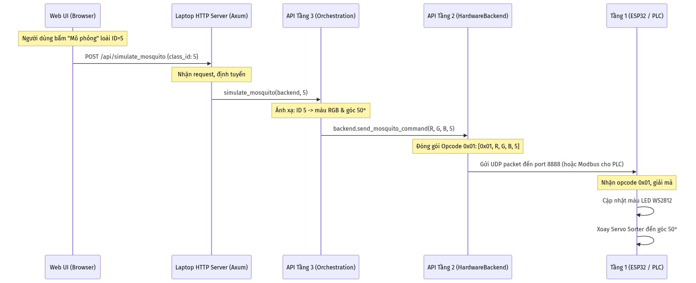

# TÀI LIỆU PHÂN TÍCH & THIẾT KẾ CHI TIẾT KIẾN TRÚC HỆ THỐNG V2
## HỆ THỐNG PHÂN LOẠI MUỖI ĐA NỀN TẢNG (ESP32 & PLC) KÈM BỘ ĐIỀU KHIỂN WEB CỤC BỘ

Tài liệu này trình bày chi tiết về kiến trúc phần mềm phiên bản V2, triết lý thiết kế đa tầng, giao thức truyền thông theo mã lệnh (Opcode), cơ chế đa luồng nâng cao trên Laptop & ESP32, bộ điều khiển giao diện Web (Vite + Vanilla JS) và các hàm API đặc tả chi tiết toàn hệ thống.

---

## 1. Tổng quan Kiến trúc Đa nền tảng (V2)

Hệ thống phân loại muỗi phiên bản V2 được tái cấu trúc thành mô hình đa nền tảng, tách biệt hoàn toàn phần logic nhận diện của AI với phần cơ cấu chấp hành phần cứng. Hệ thống hỗ trợ song song hai loại thiết bị điều khiển servo: **ESP32 S3** thông thường và **PLC công nghiệp** (phục vụ môi trường nhà máy).

```text
┌────────────────────────────────────────────────────────┐
│                     WEB UI (Vite)                      │
│   (Giao diện điều khiển, giám sát & mô phỏng cục bộ)   │
└──────────────────────────┬─────────────────────────────┘
                           │ HTTP REST API (Port 3000)
                           v
┌────────────────────────────────────────────────────────┐
│                 LAPTOP BACKEND (Rust)                  │
│                                                        │
│  [TẦNG 3: Orchestration API (api_layer3.rs)]           │
│     - Reset Home, Xoay trái/phải, Quay ô, Hoán đổi     │
│                           │
│  [TẦNG 2: Device Abstraction (hardware.rs)]            │
│     - Interface chung: HardwareBackend Trait           │
│     - Driver 1: Esp32Backend  |  Driver 2: PlcBackend  │
└─────────────┬───────────────────────────┬──────────────┘
              │ UDP Opcode (Port 8888)    │ Modbus / TCP
              v                           v
┌─────────────────────────────┐   ┌──────────────────────┐
│     TẦNG 1: ESP32 S3        │   │       TẦNG 1: PLC    │
│  - Điều khiển LED WS2812    │   │  - PLC điều khiển    │
│  - Xoay Servo Sorter (PWM)  │   │    Driver Servo      │
│  - Băng chuyền & RFID       │   │  - (Stub: print logs)│
└─────────────────────────────┘   └──────────────────────┘
```

---

## 2. Triết lý thiết kế & Phân tích Kiến trúc V2

### 2.1. Tại sao lựa chọn Kiến trúc Tách biệt (Decoupled Architecture)?
Kiến trúc V2 tuân thủ nghiêm ngặt nguyên lý **Phân tách mối quan tâm (Separation of Concerns - SoC)** và nguyên lý **Đóng/Mở (Open/Closed Principle)**:
*   **Hỗ trợ đa nền tảng không tốn sức:** Nhờ định nghĩa interface `HardwareBackend` ở Tầng 2, toàn bộ logic nhận diện của AI (YOLO) và các hàm nghiệp vụ cao cấp ở Tầng 3 (như hoán đổi ô, quay ô về vị trí) hoàn toàn **không quan tâm** thiết bị bên dưới là ESP32 hay PLC. Khi chuyển từ ESP32 sang PLC (bằng cờ `--plc`), hệ thống chỉ thay đổi Driver xuất dữ liệu mà không cần chỉnh sửa bất kỳ dòng logic AI nào.
*   **Bảo trì cơ khí độc lập:** Nếu sơ đồ cơ khí thay đổi (GPIO, số lượng răng đĩa xoay, chu kỳ duty của servo), nhóm nhúng chỉ cần cập nhật mã nguồn Tầng 1 trên ESP32/PLC. Tầng Laptop giữ nguyên hoàn toàn.

### 2.2. Ưu thế khi mở rộng số loài muỗi (Ví dụ: Từ 36 lên 40 loài)
Kiến trúc V2 được tham số hóa toàn diện giúp việc thay đổi quy mô mô hình (tăng số lượng loài) chỉ tốn **3 phút chỉnh sửa** tại 3 hằng số duy nhất:
1.  **AI Vision (types.rs):** Thêm 4 loài mới vào mảng `LABELS`. Hằng số `NUM_CLASSES` tự động tính lại.
2.  **Laptop API (api_layer3.rs):** Sửa hằng số `NUM_SLOTS = 40`. Góc xoay mỗi ô `DEGREES_PER_SLOT` tự động đổi từ `10°` thành `9°`. Hệ thống đặt tên ô tự mở rộng thêm các ô `K0` đến `N0`.
3.  **ESP32 Firmware (system.rs):** Sửa hằng số `NUM_SPECIES = 40` và `DEGREES_PER_SPECIES = 9`.
4.  **Web UI:** Không cần sửa gì cả! Web UI tự động truy vấn API `/api/species_list` lúc khởi động để vẽ lại giao diện chọn loài, đổi màu LED và tính toán ô hứng tương ứng cho 40 loài.

---

## 3. Chi tiết Phân tầng API trên Laptop

### 3.1. Tầng 3 — High-Level API (api_layer3.rs)
Định nghĩa các hàm nghiệp vụ phân phối cơ cấu mâm xoay:
*   **Quy ước đặt tên ô (Slot Naming):** Đĩa xoay 36 ô được đặt tên theo bảng chữ cái:
    *   Ô 0 đến 25: Đặt tên từ `A` đến `Z`.
    *   Ô 26 đến 35: Đặt tên từ `A0` đến `J0`.
    *   *Nếu nâng lên 40 ô:* Sẽ tự động có thêm từ `K0` đến `N0`.
*   **Thuật toán dịch chuyển ngắn nhất:** Khi xoay hoặc hoán đổi ô, Tầng 3 sẽ tính toán góc sai khác ($\Delta$) và chọn hướng quay (thuận hay ngược chiều kim đồng hồ) có quãng đường đi ngắn nhất (chuẩn hóa về khoảng $[-180^\circ, 180^\circ]$) để giảm hao mòn động cơ và rút ngắn thời gian.

### 3.2. Tầng 2 — Mid-Level API (hardware.rs)
Định nghĩa trait `HardwareBackend`:
```rust
pub trait HardwareBackend: Send + Sync {
    fn name(&self) -> &str;
    fn send_mosquito_command(&self, r: u8, g: u8, b: u8, class_id: u8);
    fn rotate_servo(&self, angle: i32);
    fn reset_home(&self);
    fn get_current_angle(&self) -> i32;
}
```
*   `Esp32Backend`: Đóng gói và truyền các byte dữ liệu thông qua giao thức UDP Opcode mới.
*   `PlcBackend`: Stub giả lập in thông tin ra màn hình console phục vụ phát triển độc lập.

### 3.3. Tầng 1 — Low-Level API (Phần cứng)
*   **ESP32 S3:** Nhận diện gói tin UDP từ cổng 8888, bóc tách opcode ở byte đầu tiên để xuất tín hiệu xung PWM (LedcDriver) điều khiển servo quay hoặc cập nhật màu dải LED WS2812 thông qua driver RMT.
*   **PLC:** Cấu hình Driver Servo công nghiệp để xoay theo góc gửi xuống.

---

## 4. HTTP API Server & Cơ chế Đa luồng trên Laptop

Laptop Backend chạy đa luồng đồng thời bằng cách sử dụng **Tokio Runtime** kết hợp với **std::thread::scope**:

1.  **Luồng Camera (Camera Thread):** Nạp ảnh MJPEG từ IP DroidCam và lưu vào bộ nhớ đệm dùng chung (`shared_frame`).
2.  **Luồng AI Inference (Inference Thread):** Cứ mỗi 200ms đọc ảnh đệm, nhận diện vật thể. Nếu phát hiện muỗi và **không ở chế độ Mô phỏng**, gửi lệnh phân loại xuống phần cứng.
3.  **Luồng UI (minifb Thread):** Vẽ khung bounding box đè lên ảnh gốc và hiển thị trực tiếp lên màn hình máy tính với tốc độ 60 FPS.
4.  **Luồng Web Server (Axum Thread):** Chạy ngầm server HTTP tại cổng `3000`. Khi nhận các REST request từ giao diện Web, luồng này sẽ tương tác với trạng thái nguyên tử (`is_simulation_mode`) hoặc trực tiếp gọi API Tầng 3 để điều khiển phần cứng.

Các luồng trao đổi dữ liệu an toàn thông qua cấu trúc khóa nguyên tử `Arc<RwLock<T>>` và `Arc<AtomicBool>`.

---

## 5. Giao diện Web UI & Chế độ Mô phỏng

Giao diện Web cục bộ (Vite + Vanilla JS) hoạt động trên trình duyệt, giao tiếp qua HTTP REST với backend Laptop:

*   **Chế độ Tự động (Auto Mode):** Trạng thái mặc định. Camera AI liên tục nhận diện và tự động xoay servo. Web UI chỉ hiển thị thông tin giám sát góc và loại thiết bị.
*   **Chế độ Mô phỏng (Simulation Mode):** Khi bật switch trên Web, backend Laptop sẽ đặt cờ `is_simulation_mode = true`. Khi này, luồng AI camera vẫn chạy hiển thị hình ảnh bình thường nhưng **ngưng gửi lệnh tự động**. Web UI sẽ mở khóa các nút nhấn điều khiển và bảng chọn loài muỗi. Người dùng chọn 1 loài muỗi, Web sẽ hiển thị chi tiết màu LED và ô hứng tương ứng, sau đó nhấn "Gửi" để bắt mâm xoay mô phỏng hoạt động.

---

## 6. Giao thức UDP Opcode mới (V2)

Để hỗ trợ nhiều loại lệnh điều khiển thủ công từ Web, gói tin UDP cũ 4-byte được mở rộng sang cấu trúc **Opcode-based** linh hoạt:

### 6.1. Opcode 0x01: Lệnh phân loại muỗi (5 bytes)
*   `Byte 0`: `0x01` (Opcode)
*   `Byte 1`: Màu đỏ (R)
*   `Byte 2`: Màu xanh lá (G)
*   `Byte 3`: Màu xanh dương (B)
*   `Byte 4`: ID loài muỗi (`class_id` từ 0-35, hoặc `0xFF` nếu không có muỗi)

### 6.2. Opcode 0x02: Lệnh xoay tuyệt đối (3 bytes)
*   `Byte 0`: `0x02` (Opcode)
*   `Byte 1`: Byte cao của góc (`angle >> 8`)
*   `Byte 2`: Byte thấp của góc (`angle & 0xFF`)
*   *Góc truyền đi dạng số nguyên 16-bit có dấu (i16) biểu diễn độ xoay.*

### 6.3. Opcode 0x03: Lệnh reset Home (1 byte)
*   `Byte 0`: `0x03` (Opcode)

### 6.4. Tính tương thích ngược (Legacy fallback)
Nếu ESP32 nhận được gói tin có kích thước đúng **4 bytes** và byte đầu tiên không khớp với bất kỳ opcode nào ở trên, hệ thống nhúng tự động xử lý theo giao thức cũ: gán `buf[0]`=R, `buf[1]`=G, `buf[2]`=B, `buf[3]`=`class_id`.

---

## 7. Bảng đặc tả chi tiết các hàm trong hệ thống

### 7.1. Tầng Laptop (Rust Backend & Web Server)

| Tên Hàm | Vị trí File | Tham số đầu vào | Giá trị trả về | Nhiệm vụ | Nơi gọi (Caller) |
| :--- | :--- | :--- | :--- | :--- | :--- |
| `HardwareBackend::send_mosquito_command` | `app_cli/src/hardware.rs` | `r, g, b, class_id` | (Không) | Gửi tín hiệu phân loại muỗi tương ứng Driver thiết bị | Luồng AI (Inference) hoặc REST handler |
| `HardwareBackend::rotate_servo` | `app_cli/src/hardware.rs` | `angle` | (Không) | Gửi tín hiệu xoay mâm đến góc tuyệt đối | API Tầng 3 |
| `HardwareBackend::reset_home` | `app_cli/src/hardware.rs` | (Không) | (Không) | Gửi tín hiệu reset mâm về 0° | API Tầng 3 |
| `slot_name` | `app_cli/src/api_layer3.rs` | `index` | `String` | Ánh xạ chỉ số ô sang tên hiển thị (A-Z, A0-J0) | Web Server API |
| `slot_index` | `app_cli/src/api_layer3.rs` | `name` | `Option<usize>` | Ánh xạ tên ô (A-Z, A0-J0) ngược lại chỉ số ô | Web Server API |
| `reset_home` | `app_cli/src/api_layer3.rs` | `backend` | (Không) | Gọi lệnh đưa mâm về điểm xuất phát | Web Server API |
| `rotate_left` | `app_cli/src/api_layer3.rs` | `backend, n_degrees` | (Không) | Tính góc mục tiêu lệch trái N° và gửi lệnh xoay | Web Server API |
| `rotate_right` | `app_cli/src/api_layer3.rs` | `backend, n_degrees` | (Không) | Tính góc mục tiêu lệch phải N° và gửi lệnh xoay | Web Server API |
| `rotate_slot_to_angle` | `app_cli/src/api_layer3.rs` | `backend, slot, angle` | (Không) | Tính toán góc lệch của ô `slot` và thực thi quay | Web Server API |
| `move_slot_to_slot` | `app_cli/src/api_layer3.rs` | `backend, from, to` | (Không) | Tính delta ngắn nhất và di chuyển ô `from` đến ô `to` | Web Server API |
| `start_server` | `app_cli/src/web_server.rs` | `backend, sim_mode, port` | (Không) | Khởi chạy Server Axum lắng nghe REST API dưới nền | Hàm `run()` của `main.rs` |

### 7.2. Tầng Nhúng (Firmware ESP32)

| Tên Hàm | Vị trí File | Tham số đầu vào | Giá trị trả về | Nhiệm vụ | Nơi gọi (Caller) |
| :--- | :--- | :--- | :--- | :--- | :--- |
| `Sorter::rotate_to` | `src/sorter.rs` | `target_angle` | `Result<(), Error>` | Xoay mâm phân loại đến góc bất kỳ | Loop nhận UDP (Opcode 0x01, 0x02) |
| `Sorter::reset_to_home` | `src/sorter.rs` | (Không) | `Result<(), Error>` | Xoay mâm phân loại về 0° | Setup ban đầu hoặc Opcode 0x03 |
| `system::run` | `src/system.rs` | (Không) | `Result<(), Error>` | Cấu hình mạng, chạy luồng RFID và vòng lặp giải mã UDP | Entry point `main.rs` |

---

## 8. Sơ đồ tuần tự truyền nhận dữ liệu V2

Luồng tương tác khi người dùng thực hiện kích hoạt Mô phỏng một loài muỗi bất kỳ trên Web UI được mô tả chi tiết qua sơ đồ dưới đây:


