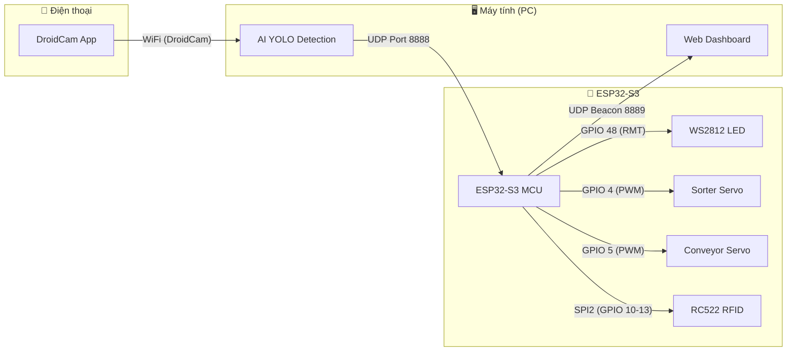
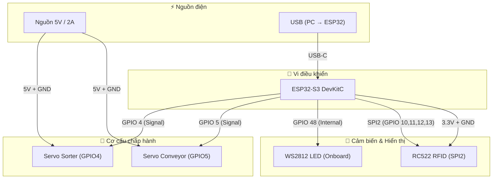

# 🦟 Hướng dẫn Đấu nối Dây — Hệ thống Phân loại Muỗi bằng AI

> **Dự án**: AI Mosquito Detector & Sorter  
> **Vi điều khiển**: ESP32-S3 (Flash 8MB)  
> **Phiên bản tài liệu**: 1.0 — Ngày 24/07/2026

---

## 📋 Mục lục

1. [Tổng quan hệ thống](#1-tổng-quan-hệ-thống)
2. [Danh sách linh kiện](#2-danh-sách-linh-kiện)
3. [Sơ đồ khối hệ thống](#3-sơ-đồ-khối-hệ-thống)
4. [Bảng đấu nối chân chi tiết](#4-bảng-đấu-nối-chân-chi-tiết)
5. [Hướng dẫn đấu nối từng module](#5-hướng-dẫn-đấu-nối-từng-module)
6. [Sơ đồ nguồn điện](#6-sơ-đồ-nguồn-điện)
7. [Lưu ý an toàn & Khắc phục sự cố](#7-lưu-ý-an-toàn--khắc-phục-sự-cố)

---

## 1. Tổng quan hệ thống

Hệ thống **Phân loại Muỗi bằng AI** bao gồm 2 phần chính:

### 🖥️ Phần PC (Máy tính)
- **Camera**: Điện thoại Android sử dụng ứng dụng **DroidCam** để truyền hình ảnh qua WiFi.
- **Phần mềm AI**: Chạy model YOLO nhận diện loài muỗi, gửi lệnh phân loại qua **UDP** đến ESP32.
- **Web UI**: Giao diện trực quan hiển thị camera AI trực tiếp, trạng thái thiết bị và lịch sử nhận diện.

### 🔌 Phần ESP32 (Phần cứng)
- **ESP32-S3**: Vi điều khiển trung tâm, nhận lệnh UDP từ PC.
- **Servo phân loại (Sorter)**: Servo quay liên tục 360° gắn đĩa tròn chia 36 ô, mỗi ô tương ứng 1 loài muỗi (10°/ô).
- **Servo băng chuyền (Conveyor)**: Servo quay liên tục 360° kéo dây curoa băng chuyền.
- **Đèn LED WS2812**: Hiển thị trạng thái hệ thống và màu RGB theo loài muỗi.
- **Module RFID RC522**: Quẹt thẻ để bật/tắt khẩn cấp băng chuyền.



---

## 2. Danh sách linh kiện

| STT | Linh kiện | Số lượng | Thông số kỹ thuật | Ghi chú |
|:---:|:---|:---:|:---|:---|
| 1 | Board ESP32-S3 DevKitC (8MB Flash) | 1 | 3.3V logic, WiFi + BLE | Vi điều khiển chính |
| 2 | Servo SG90 — Quay liên tục 360° | 2 | 5V, ~500mA mỗi con | 1 cho Sorter, 1 cho Conveyor |
| 3 | LED WS2812 (NeoPixel) | 1 | Tích hợp sẵn trên mạch | Đèn trạng thái RGB (Onboard) |
| 4 | Module RFID RC522 | 1 | 3.3V, giao tiếp SPI | Kèm thẻ RFID |
| 5 | Nguồn 5V DC (≥ 2A) | 1 | 5V / 2A trở lên | Cấp nguồn cho 2 Servo |
| 6 | Breadboard hoặc PCB đục lỗ | 1 | — | Để đấu nối |
| 7 | Dây jumper Đực-Đực / Đực-Cái | ~20 sợi | — | Kết nối các module |
| 8 | Điện thoại Android | 1 | Có camera, cài DroidCam | Làm camera AI |
| 9 | Cáp USB Type-C | 1 | — | Nạp code và cấp nguồn ESP32 |
| 10 | Đĩa phân loại (tự chế) | 1 | 36 ô, gắn trục servo | Xoay phân loại muỗi |
| 11 | Băng chuyền (tự chế) | 1 | Dây curoa + con lăn | Kéo bởi servo |

---

## 3. Sơ đồ khối hệ thống



---

## 4. Bảng đấu nối chân chi tiết

### 📌 Tổng hợp tất cả chân GPIO sử dụng

| Chân ESP32-S3 | Kết nối đến | Giao thức | Chức năng |
|:---:|:---|:---:|:---|
| **GPIO 48** | WS2812 — Chân **DIN** (Data In) | RMT | Điều khiển LED RGB trạng thái |
| **GPIO 4** | Servo Sorter — Chân **Signal** (dây cam/vàng) | PWM 50Hz | Xoay đĩa phân loại muỗi |
| **GPIO 5** | Servo Conveyor — Chân **Signal** (dây cam/vàng) | PWM 50Hz | Kéo băng chuyền |
| **GPIO 12** | RC522 — Chân **SCK** | SPI2 Clock | Xung nhịp SPI cho RFID |
| **GPIO 11** | RC522 — Chân **MOSI** (SDA) | SPI2 MOSI | Dữ liệu từ ESP32 → RC522 |
| **GPIO 13** | RC522 — Chân **MISO** | SPI2 MISO | Dữ liệu từ RC522 → ESP32 |
| **GPIO 10** | RC522 — Chân **SDA** (CS/SS) | SPI2 CS | Chip Select (chọn thiết bị SPI) |
| **3V3** | RC522 — Chân **3.3V** | Nguồn | Cấp nguồn cho RC522 |
| **GND** | Tất cả GND (chung) | Nguồn | Nối mass chung toàn bộ hệ thống |

> [!IMPORTANT]
> **Tất cả GND phải được nối chung** — GND của ESP32, GND của nguồn 5V, GND của servo, GND của LED, GND của RC522 đều phải nối với nhau tại cùng một điểm mass chung.

---

## 5. Hướng dẫn đấu nối từng module

### 5.1 🔴 Đèn LED WS2812 (NeoPixel) - Tích hợp trên mạch

Đèn LED WS2812 hiển thị trạng thái hệ thống **đã được tích hợp sẵn (onboard)** trên hầu hết các board ESP32-S3 DevKitC và được nối ngầm với chân **GPIO 48**.

**Trạng thái hiển thị:**
- 🟠 **Cam** — Đang ở chế độ cấu hình WiFi (AP Mode)
- 🟢 **Xanh lá nhấp nháy** — Khởi động thành công, sẵn sàng hoạt động
- ⚫ **Tắt** — Chờ lệnh
- 🌈 **Màu RGB tùy chỉnh** — Hiển thị màu tương ứng loài muỗi đang phân loại

**Cách đấu nối:**
- **Không cần đấu nối thêm dây.** Đèn LED này sử dụng chung nguồn của board ESP32 (lấy từ cổng USB) và nhận tín hiệu điều khiển trực tiếp từ chip.

---

### 5.2 🔵 Servo Phân loại Muỗi (Sorter) — GPIO 4

Servo SG90 quay liên tục 360° gắn trục đĩa tròn chia 36 ô. Khi nhận lệnh phân loại từ AI, servo xoay đĩa đến đúng ô tương ứng loài muỗi.

**Thông số PWM:**
- Tần số: **50 Hz** (chu kỳ 20ms)
- Độ phân giải: **14-bit** (0–16383)
- Dừng (Stop): duty = **1229** (~1.5ms, vị trí trung tâm)
- Quay thuận (CW): duty = **1106** (~1.35ms)
- Quay ngược (CCW): duty = **1352** (~1.65ms)
- Tốc độ: **6 ms/độ** (quay 10° mất ~60ms)

**Dây servo SG90 có 3 sợi:**

| Màu dây Servo | Chức năng | Nối đến |
|:---:|:---|:---|
| 🟤 **Nâu** (hoặc Đen) | GND | **GND chung** |
| 🔴 **Đỏ** | VCC (5V) | Nguồn ngoài **5V** |
| 🟠 **Cam** (hoặc Vàng) | Signal (PWM) | ESP32 **GPIO 4** |

**Mô tả bằng chữ:**
1. Cắm đầu cắm 3 chân của servo vào breadboard.
2. Dây **nâu** (GND) — nối vào hàng GND chung trên breadboard.
3. Dây **đỏ** (VCC) — nối vào cọc **dương (+) 5V** của nguồn ngoài. ⚠️ KHÔNG cắm vào chân 5V trên ESP32 vì dòng không đủ.
4. Dây **cam** (Signal) — nối bằng dây jumper đực-đực vào chân **GPIO 4** trên board ESP32.

> [!WARNING]
> Servo SG90 quay liên tục 360° khi cắm điện lần đầu có thể tự quay do tín hiệu chưa ổn định. Đảm bảo code đã nạp trước khi cấp nguồn servo để tránh đĩa phân loại xoay hỗn loạn.

---

### 5.3 🟢 Servo Băng chuyền (Conveyor) — GPIO 5

Servo SG90 quay liên tục 360° kéo dây curoa băng chuyền. Được điều khiển bật/tắt bằng thẻ RFID hoặc lệnh UDP.

**Thông số PWM:**
- Tần số: **50 Hz**
- Độ phân giải: **14-bit**
- Dừng (Stop): duty = **1229**
- Tốc độ chạy (CW): duty = **1150** (tốc độ chậm, đủ vượt deadband servo)

**Cách đấu nối:**

| Màu dây Servo | Chức năng | Nối đến |
|:---:|:---|:---|
| 🟤 **Nâu** (hoặc Đen) | GND | **GND chung** |
| 🔴 **Đỏ** | VCC (5V) | Nguồn ngoài **5V** |
| 🟠 **Cam** (hoặc Vàng) | Signal (PWM) | ESP32 **GPIO 5** |

**Mô tả bằng chữ:**
1. Đấu nối hoàn toàn giống Servo Sorter, chỉ khác duy nhất dây **cam** (Signal) nối vào chân **GPIO 5** (thay vì GPIO 4).
2. Dây **nâu** → GND chung.
3. Dây **đỏ** → Nguồn 5V bên ngoài.
4. Dây **cam** → **GPIO 5** trên ESP32.

---

### 5.4 📡 Module RFID RC522 — SPI2

Module RC522 đọc thẻ RFID để **bật/tắt khẩn cấp băng chuyền**. Khi quẹt đúng thẻ được ủy quyền (UID: `6C:FC:CA:06`), hệ thống sẽ dừng hoặc chạy lại băng chuyền.

**Thông số SPI:**
- Bus: **SPI2**
- Tốc độ: **1 MHz**
- Chế độ polling: mỗi **100ms** quét thẻ một lần
- Thời gian chống rung (debounce): **2 giây** giữa 2 lần quẹt

**Cách đấu nối:**

| Chân RC522 | Chức năng | Nối đến ESP32-S3 |
|:---:|:---|:---|
| **3.3V** | Nguồn | ESP32 chân **3V3** |
| **GND** | Mass | **GND chung** |
| **RST** | Reset | *(Không sử dụng — để trống hoặc nối 3.3V)* |
| **IRQ** | Interrupt | *(Không sử dụng — để trống)* |
| **SDA** (CS/SS) | Chip Select | ESP32 **GPIO 10** |
| **SCK** | Serial Clock | ESP32 **GPIO 12** |
| **MOSI** | Master Out Slave In | ESP32 **GPIO 11** |
| **MISO** | Master In Slave Out | ESP32 **GPIO 13** |

**Mô tả bằng chữ:**
1. Chân **3.3V** trên RC522 → nối vào chân **3V3** trên board ESP32 (⚠️ RC522 dùng **3.3V**, KHÔNG nối 5V vì sẽ hỏng module).
2. Chân **GND** trên RC522 → nối vào **GND chung**.
3. Chân **SDA** (cũng gọi là CS hoặc SS) trên RC522 → nối vào **GPIO 10** trên ESP32.
4. Chân **SCK** trên RC522 → nối vào **GPIO 12** trên ESP32.
5. Chân **MOSI** trên RC522 → nối vào **GPIO 11** trên ESP32.
6. Chân **MISO** trên RC522 → nối vào **GPIO 13** trên ESP32.
7. Chân **RST** và **IRQ** trên RC522 → để trống (không nối), hoặc nối RST lên 3.3V nếu muốn.

> [!CAUTION]
> **Module RC522 hoạt động ở mức logic 3.3V.** Tuyệt đối KHÔNG cấp nguồn 5V cho module này — sẽ gây hỏng vĩnh viễn IC MFRC522 bên trong.

---

### 5.5 📱 Camera (Điện thoại Android + DroidCam)

Camera không kết nối trực tiếp với ESP32 mà kết nối với **máy tính (PC)** qua WiFi:

1. Cài ứng dụng **DroidCam** trên điện thoại Android (từ Google Play Store).
2. Cài phần mềm **DroidCam Client** trên máy tính.
3. Đảm bảo điện thoại và máy tính **cùng một mạng WiFi**.
4. Mở DroidCam trên điện thoại → ghi nhận **IP và Port** hiển thị.
5. Mở DroidCam Client trên PC → nhập IP và Port → kết nối.
6. Phần mềm AI trên PC sẽ nhận hình ảnh từ DroidCam để nhận diện muỗi.

> [!NOTE]
> Không có dây nối nào giữa điện thoại và ESP32. Toàn bộ giao tiếp là không dây: Điện thoại → WiFi → PC (AI xử lý) → WiFi/UDP → ESP32 (điều khiển cơ cấu).

---

## 6. Sơ đồ nguồn điện

### ⚡ Yêu cầu nguồn điện

| Thành phần | Điện áp | Dòng tiêu thụ (max) | Nguồn cấp |
|:---|:---:|:---:|:---|
| ESP32-S3 DevKitC | 3.3V (nội bộ) | ~500mA | USB-C từ PC |
| Servo Sorter (SG90) | 5V | ~500mA | Nguồn ngoài 5V/2A |
| Servo Conveyor (SG90) | 5V | ~500mA | Nguồn ngoài 5V/2A |
| LED WS2812 (Onboard) | 3.3V | ~60mA (1 LED) | Tích hợp sẵn (USB) |
| RC522 RFID | 3.3V | ~26mA | Chân 3V3 trên ESP32 |
| **Tổng cộng** | — | **~1.5A** | — |

### 🔋 Cách đấu nguồn

```
┌─────────────────────────────────────────────────────────┐
│                   NGUỒN 5V / 2A                         │
│                                                         │
│   (+) 5V ──┬──→ Servo Sorter (dây ĐỎ)                  │
│            └──→ Servo Conveyor (dây ĐỎ)                 │
│                                                         │
│   (-) GND ──┬──→ Servo Sorter (dây NÂU)                │
│             ├──→ Servo Conveyor (dây NÂU)               │
│             ├──→ RC522 RFID (chân GND)                  │
│             └──→ ESP32-S3 (chân GND)  ← ⚡ BẮT BUỘC    │
│                                                         │
└─────────────────────────────────────────────────────────┘

┌─────────────────────────────────────────────────────────┐
│                   USB-C (từ PC)                         │
│                                                         │
│   → Cấp nguồn 5V cho ESP32-S3 qua cổng USB-C           │
│   → ESP32 tự hạ áp xuống 3.3V nội bộ                   │
│   → Chân 3V3 trên board → Cấp nguồn cho RC522          │
│                                                         │
└─────────────────────────────────────────────────────────┘
```

> [!IMPORTANT]
> **Quy tắc vàng: GND CHUNG (Common Ground)**
> 
> Tất cả các GND trong hệ thống **PHẢI** được nối với nhau:
> - GND của nguồn 5V ngoài
> - GND của ESP32 (chân GND trên board)
> - GND của 2 servo
> - GND của RC522
> 
> Nếu không nối GND chung, tín hiệu PWM và SPI sẽ bị nhiễu, servo quay sai, LED sáng lung tung, RFID không đọc được thẻ.

---

## 7. Lưu ý an toàn & Khắc phục sự cố

### ⚠️ Lưu ý an toàn

1. **Kiểm tra kỹ trước khi cấp nguồn**: Đảm bảo tất cả dây nối đúng vị trí. Nối ngược nguồn 5V vào chân 3.3V sẽ gây cháy module.
2. **RC522 chỉ dùng 3.3V**: Module này cực kỳ nhạy cảm với quá áp. Tuyệt đối không cấp 5V.
3. **Servo cần nguồn ngoài**: Không lấy nguồn 5V từ chân VIN/5V trên ESP32 cho servo — dòng không đủ sẽ gây reset liên tục (brownout).
4. **Không chạm tay vào mạch khi đang cấp nguồn**: Đặc biệt khi servo đang quay.

### 🔧 Khắc phục sự cố thường gặp

| Triệu chứng | Nguyên nhân | Cách khắc phục |
|:---|:---|:---|
| ESP32 tự reset liên tục (brownout) | Servo hút quá nhiều dòng từ USB | Dùng nguồn 5V ngoài riêng cho servo |
| Servo quay hỗn loạn khi bật nguồn | Tín hiệu PWM chưa ổn định | Nạp code trước, rồi mới cấp nguồn servo |
| LED WS2812 nhấp nháy ngẫu nhiên | Nhiễu tín hiệu trên dây Data | Thêm điện trở 330Ω trên dây DIN |
| RC522 không đọc được thẻ | Nối sai chân SPI hoặc cấp 5V | Kiểm tra lại bảng đấu nối SPI, đảm bảo dùng 3.3V |
| WiFi không kết nối | Sai SSID/Password | Quẹt vào AP Mode (`Mosquito-Sorter-AP`) để cấu hình lại |
| Web Dashboard không tìm thấy ESP32 | ESP32 chưa phát beacon UDP | Kiểm tra cùng mạng WiFi, đợi tín hiệu beacon trên port 8889 |
| Servo Sorter xoay sai vị trí | Chưa calibrate deadband | Điều chỉnh hằng số `DUTY_STOP`, `DUTY_SLOW_CW`, `DUTY_SLOW_CCW` trong code |
| Băng chuyền không chạy sau quẹt thẻ | UID thẻ không khớp | UID mặc định là `6C:FC:CA:06`. Đổi trong code nếu dùng thẻ khác |

### 📶 Thông tin mạng

| Thông số | Giá trị |
|:---|:---|
| WiFi mặc định (STA) | SSID: `Gia5`, Password: `Gi@123456789` |
| WiFi cấu hình (AP) | SSID: `Mosquito-Sorter-AP`, Password: *(không có)* |
| Hostname | `mosquito-sorter` (`mosquito-sorter.local`) |
| UDP lắng nghe lệnh | Port **8888** |
| UDP phát beacon | Port **8889** (mỗi 1 giây, payload: `mosquito-sorter-beacon`) |
| Web cấu hình WiFi | `http://192.168.71.1` (khi ở AP Mode) |

