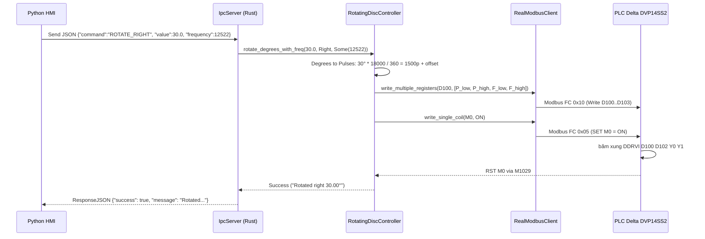

# ĐẶC TẢ KIẾN TRÚC MÃ NGUỒN - LOADING SYSTEM VERSION 1.3

**Tác giả:** Vương Quốc Khánh, Trương Hoàng Nam, Trần Doãn Hoàng Lâm  
**Phiên bản:** Version 1.3 (Cập nhật ngày 22/07/2026)

---

## 1. TỔNG QUAN TỔ CHỨC THƯ MỤC NGUỒN

Dự án được tổ chức thành 3 tầng độc lập nhưng liên kết chặt chẽ qua giao thức chuẩn công nghiệp:

```
loading_system/
├── plc_firmware/               # Layer 1: Firmware PLC Delta DVP14SS2
│   ├── standalone_test.il      #   Logic kiểm thử cô lập (Level 1)
│   └── dynamic_mode.il         #   Firmware Modbus RTU 8-bit H87 (Level 2-5)
├── rust_backend/               # Layer 2: Async Backend Daemon (Rust Tokio Engine)
│   ├── Cargo.toml              #   Cargo manifest (default-run = "loading-daemon")
│   ├── config.toml             #   Cấu hình cổng COM5, Modbus Slave ID, Baud 9600
│   └── src/
│       ├── main.rs             #   Entry point Backend Daemon (Tokio async)
│       ├── lib.rs              #   Library root
│       ├── api/                #   Cụm giao tiếp IPC Socket TCP
│       │   ├── commands.rs     #   Struct CommandMessage & ResponseMessage (JSON)
│       │   └── ipc_server.rs   #   TCP Server với Length-Prefixed JSON framing
│       ├── hardware/           #   Cụm giao tiếp phần cứng PLC
│       │   ├── modbus_client.rs#   Real & Mock Modbus RTU client driver
│       │   └── rotating_disc.rs#   RotatingDiscController (Pulse & Frequency Control)
│       └── calibration/        #   Cụm quản lý tự học bù sai số EMA
│           ├── learning.rs     #   Thuật toán EMA (Exponential Moving Average)
│           └── profile.rs      #   Profile lưu vĩnh viễn calibration.json
├── python_hmi/                 # Layer 3: Giao diện HMI 3D (customtkinter)
│   ├── main.py                 #   Entry point HMI GUI
│   └── app/
│       ├── hmi_app.py          #   Main Window & Log Console phóng to
│       ├── system_visualizer.py#   Canvas 3D 4 Phân Hệ & 12 Lọ riêng 12 loài
│       ├── control_panel.py    #   Bảng cấu hình vật lý & Thuật toán điều tốc
│       ├── override_panel.py   #   Bảng Fine Tune ±0.5° (Level 4/5)
│       └── zmq_client.py       #   Socket TCP IPC Client gửi command JSON
└── docs/                     # Tài liệu hướng dẫn & Báo cáo phiên bản 1.3
```

---

## 2. GIAO THỨC IPC SOCKET TCP & JSON PAYLOAD (V1.3 EXTENSION)

Hệ thống giao tiếp giữa **Python HMI** và **Rust Backend** thông qua TCP Socket tại địa chỉ `127.0.0.1:5555`.  
Giao thức đóng gói dữ liệu (Framing Protocol): **4 Bytes Big-Endian Length Prefix + UTF-8 JSON Payload**.

### 2.1. Struct Cấu Trúc Lệnh JSON (HMI ➔ Backend)

Trong Version 1.3, gói tin `CommandMessage` bổ sung trường `"frequency"` để truyền tần số Hz tùy chỉnh xuống Motor thực tế:

```rust
// rust_backend/src/api/commands.rs
#[derive(Debug, Clone, Serialize, Deserialize)]
pub struct CommandMessage {
    pub command: String,
    #[serde(default)]
    pub value: Option<f64>,
    #[serde(default)]
    pub frequency: Option<u32>, // <--- BỔ SUNG TRONG V1.3
}
```

### 2.2. Ví dụ Payload Lệnh JSON

1. **Lệnh Quay Phải kèm Tần số Tự động (Hz):**
   ```json
   {
     "command": "ROTATE_RIGHT",
     "value": 30.0,
     "frequency": 12522
   }
   ```
2. **Lệnh Quay Trái kèm Tần số Tùy chỉnh:**
   ```json
   {
     "command": "ROTATE_LEFT",
     "value": 90.0,
     "frequency": 20000
   }
   ```
3. **Lệnh Quay Về Gốc 0°:**
   ```json
   {
     "command": "RETURN_HOME"
   }
   ```
4. **Lệnh Lấy Trạng Thái Real-time:**
   ```json
   {
     "command": "GET_STATUS"
   }
   ```

---

## 3. LUỒNG THỰC THI TRONG RUST BACKEND DAEMON



---

## 4. QUẢN LÝ LỌ VÀ THUẬT TOÁN ĐIỀU TỐC TRÊN PYTHON HMI

### 4.1. Struct 12 Lọ - 12 Loài Muỗi (SystemVisualizer)
Thư viện `system_visualizer.py` khởi tạo 12 dictionary độc lập:
```python
self.jar_counts = {i: 0 for i in range(1, 13)}
self.jar_assigned_species = {i: i for i in range(1, 13)}  # Lọ i -> Loài i
self.species_assigned_jar = {i: i for i in range(1, 13)}  # Loài i -> Lọ i
```

### 4.2. Thuật toán Điều Tốc Tự Động (ControlPanel)
```python
def calculate_optimal_frequency(self, delta_degrees: float) -> Tuple[int, float]:
    delta_deg = abs(delta_degrees)
    pulses = round(delta_deg * 18000.0 / 360.0)
    
    t_drop = self.get_physical_drop_time()
    t_target = min(1.0, t_drop)
    
    calc_freq = int(round(pulses / t_target))
    final_freq = max(1000, min(9000, calc_freq))
    actual_duration = pulses / final_freq
    return final_freq, actual_duration
```
